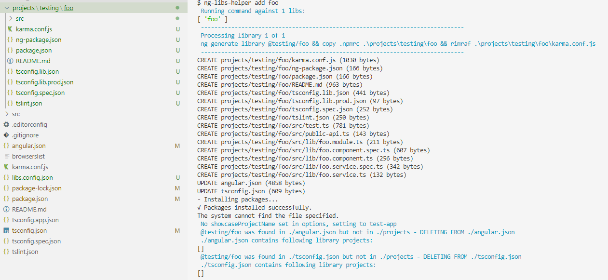
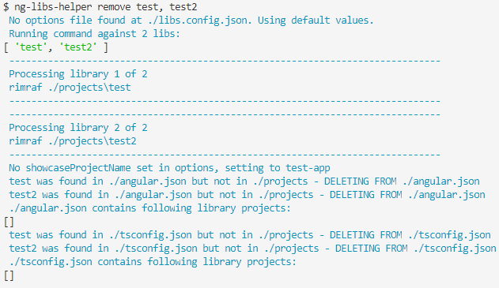
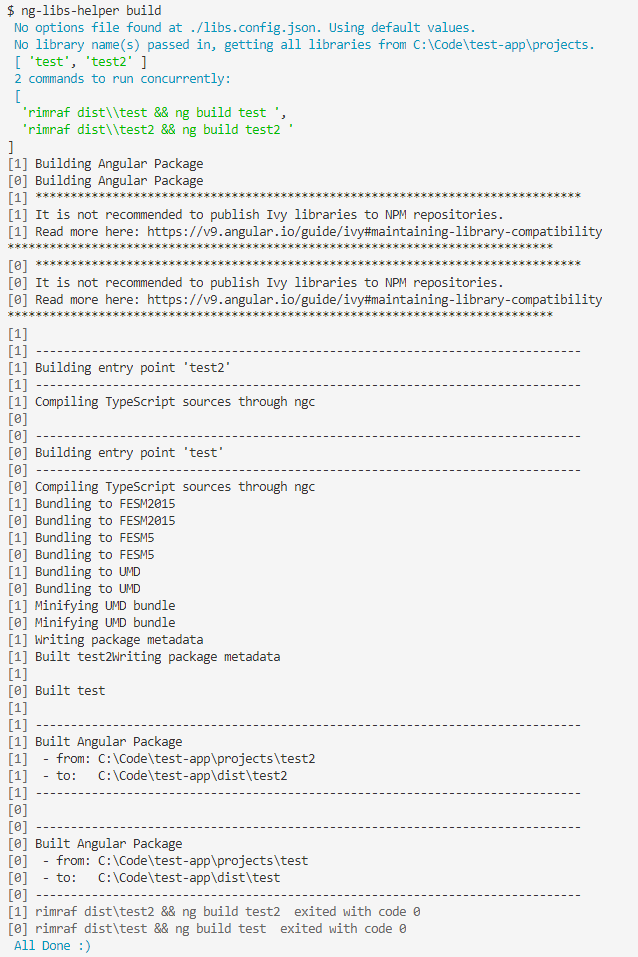
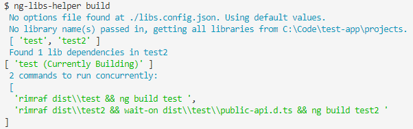
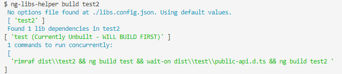
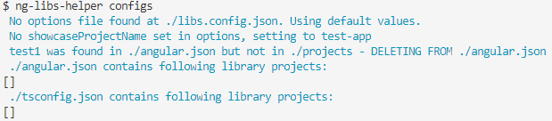
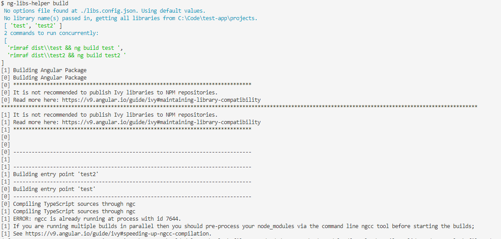

# ng-libs-helper
Scripts for working with angular library projects.

You will need to install the peer dependencies globally first:

```
npm install -g rimraf wait-on
```

# Hello World Tutorial
Create a new angular app:

```
ng new test-app
```

Add this package:

```
npm install @chapichapi/ng-libs-helper
```

Setup the package.json scripts:

```json
"scripts": {
  ...
  "add_libs": "chapichapi-ng-libs add",
  "remove_libs": "chapichapi-ng-libs remove",
  "build_libs": "chapichapi-ng-libs build",
  "configs_libs": "chapichapi-ng-libs configs",
  "serve_libs": "chapichapi-ng-libs serve"
  ...
}
```

Add two new libraries:

```shell
npm run add_libs test1, test2
```

Once this has run then you should see two new projects appear along with some updates in the angular.json and the tsconfig.json.
Go into test2 package.json and add a peer dependency to test1:

```json
"peerDependencies": {
    "@angular/common": "^9.1.9",
    "@angular/core": "^9.1.9",
    "test1": "0.0.1"
  },
```

Now add the module import in the test2.module.ts:

```ts
import { NgModule } from '@angular/core';
import { Test2Component } from './test2.component';
import { Test1Module } from 'test1';

@NgModule({
  declarations: [Test2Component],
  imports: [
    Test1Module
  ],
  exports: [Test2Component]
})
export class Test2Module { }
```

And add the component selector for lib-test1 into the test2.component.ts:
```ts
import { Component, OnInit } from '@angular/core';

@Component({
  selector: 'lib-test2',
  template: `
    <p>
      test2 works!
    </p>
    <lib-test1></lib-test1>
  `,
  styles: [
  ]
})
export class Test2Component implements OnInit {

  constructor() { }

  ngOnInit(): void {
  }

}
```

Now you can run:

```
npm run serve_libs
```

And you will see that the libs-helper package discovers the dependency on test1 inside test2 and builds them in the correct order before serving the main showcase app.

If you now add these libs to the main app:
(app.module.ts)
```ts
import { BrowserModule } from '@angular/platform-browser';
import { NgModule } from '@angular/core';

import { AppComponent } from './app.component';
import { Test1Module } from 'test1';
import { Test2Module } from 'test2';

@NgModule({
  declarations: [
    AppComponent
  ],
  imports: [
    BrowserModule,
    Test1Module,
    Test2Module
  ],
  providers: [],
  bootstrap: [AppComponent]
})
export class AppModule { }
```

(app.component.html - just replace the default boilerplate with the following)
```html
<lib-test2></lib-test2>
```

If you now navigate to localhost:4200 then you should see it display:

test2 works!

test1 works!

This is because we have the test1 component as a dependency in the test2 component.
Now go into the test1.component.ts and replace the template html:

```ts
import { Component, OnInit } from '@angular/core';

@Component({
  selector: 'lib-test2',
  template: `
    <h1>Hello World!!</h1>
  `,
  styles: [
  ]
})
export class Test2Component implements OnInit {

  constructor() { }

  ngOnInit(): void {
  }

}
```

If you now save the file then you should see that the libraries are both rebuilt and the site on localhost:4200 has updated to:

test2 works!
## Hello World!

---- Bish bash gravy! you're all setup to build an angular library.

# Commands
## add
Adds one or more library projects whilst also [running the configs command](#configs).


### Adding with a scope name
Below is an example of using the add command with a scopename configured (which would be the recommended way of working),
this is performed having the following in the [lib.config.json](#libsconfigjson-options) :

```json
{
  "scopeName": "@testing"
}
```



## remove
Removes one or more library projects whilst also [running the configs command](#configs).



## build
Builds all libaries, or the ones passed in as arguments.



### Dependencies
The build script does the work of scanning each build target's package.json to see if there is a reference to another project in the library, using this it generates the commands to run based on this dependency tree:



It also does this when the build targets does not include the dependencies:



## serve

## configs
This ensures that the angular.json and tsconfig.json files are updated and in the correct format.



You can see come more examples of this being run at the end of the [add](#add) and [remove](#remove) scripts.

# Notes
You may at some point get an error stating something about ngcc.lock such as this:



you should be able to just re-run the command and it will work - sometimes (very infrequently in my experience) this can just happen when running multiple ngcc commands.

# libs.config.json Options
You can configure the scripts by adding a `libs.config.json` file to the root of your app.
You do not have to add this, but if you don't then the default values will be used.
Below are the options:

## libsPath
The relative path to where the library projects are kept, by default this is ./projects.

## angularJsonPath
The relative path to where the angular.json file is kept, by default this is ./angular.json.

## karmaConfigPath
The relative path to where the karma configuration file is kept, by default this is ./karma.conf.js.

## tsconfigPath
The relative path to where the tsconfig.json configuration file is kept, by default this is ./tsconfig.json.

## showcaseProjectName
The name of the showcase application for having a frontend to test and showcase the different library projects.
if left blank, then this is determined based on the first 'application' type project found in the angular.json file.

## libraryNamePrefix
A prefix name for the libraries, for example you may want all libraries to start with 'ng-' or 'ngx-' or something else.

## scopeName
A scopename for all packages such as @foo (e.g. @foo/bar package).

## isPublicScope
Determine if packages should be public (for npm consumption) or private packages for enterprise consumption.

## libFileToWaitOnForBuild
The file to look at to wait on to ascertain whether a library has been built. By default this is public-api.d.ts.

## npmrcPath
The path to an npmrc file to copy - if using private npm registries.