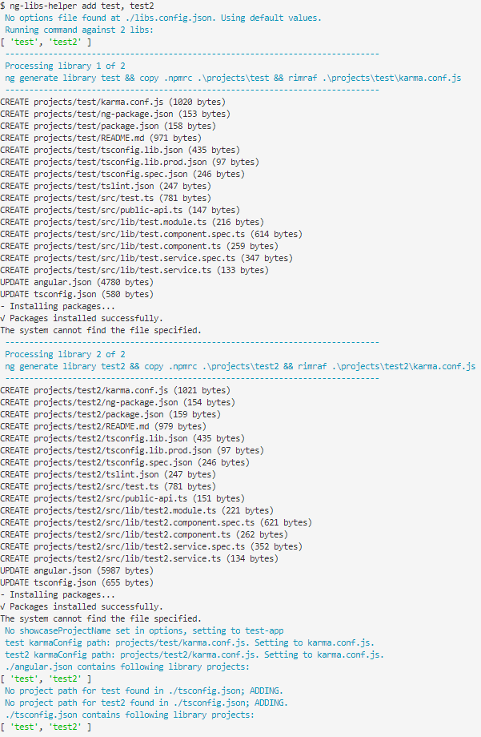

# ng-libs-helper
Scripts for working with angular library projects.

You will need to install the peer dependencies globally first:

```
npm install -g rimraf wait-on
```

# Commands
## add
Adds one or more library projects whilst also [running the configs command](#configs).



## remove
Removes one or more library projects whilst also [running the configs command](#configs).


## build
Builds all libaries, or the ones passed in as arguments.


### Dependencies
The build script does the work of scanning each build target's package.json to see if there is a reference to another project in the library, using this it generates the commands to run based on this dependency tree:


It also does this when the build targets does not include the dependencies:


## serve

## configs
This ensures that the angular.json and tsconfig.json files are updated and in the correct format.


You can see come more examples of this being run at the end of the [add](#add) and [remove](#remove) scripts.

# Notes
You may at some point get an error stating something about ngcc.lock such as this:


you should be able to just re-run the command and it will work - sometimes (very infrequently in my experience) this can just happen when running multiple ngcc commands.